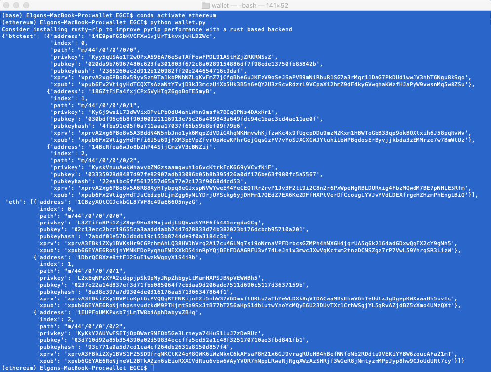
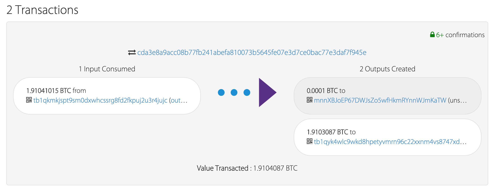
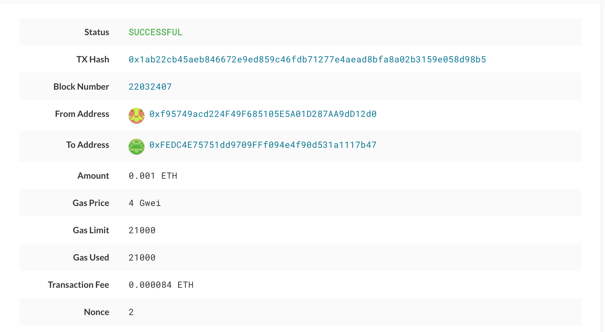
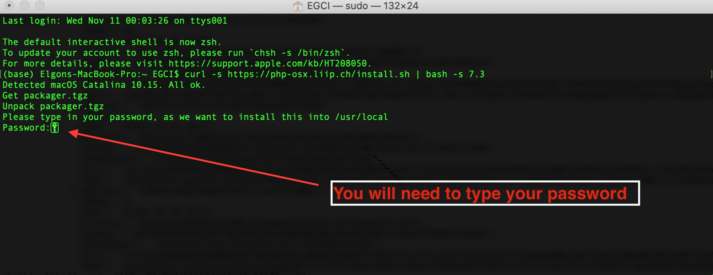
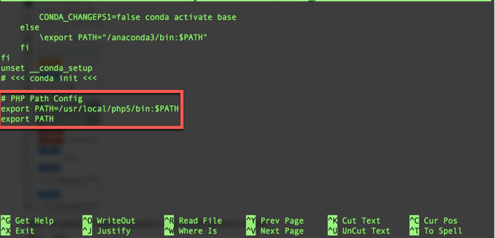
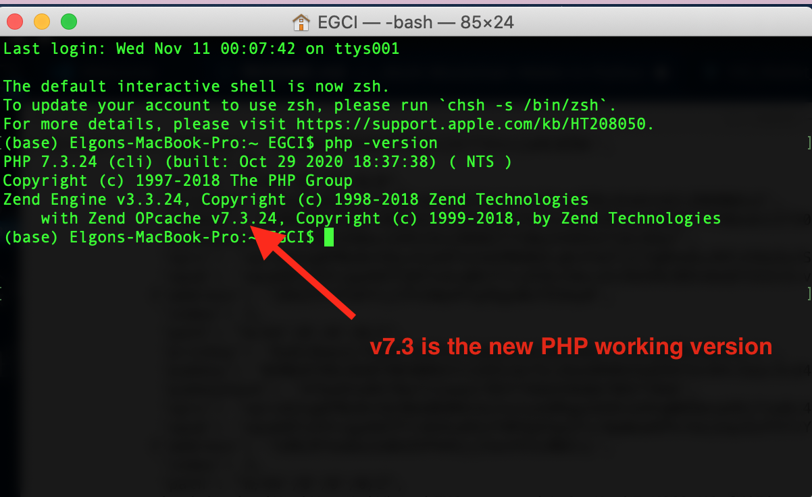
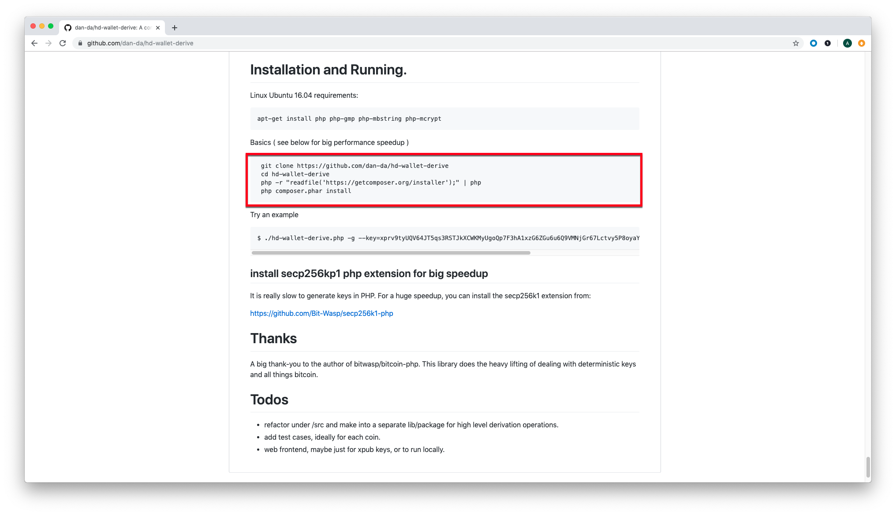
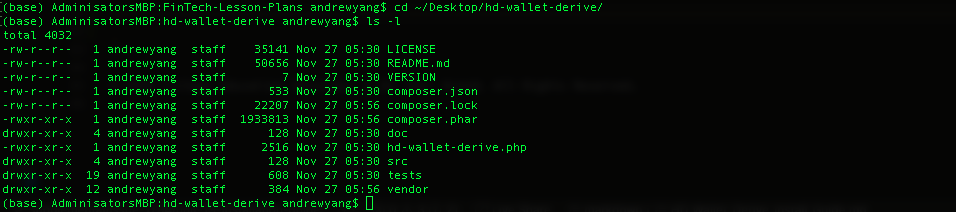
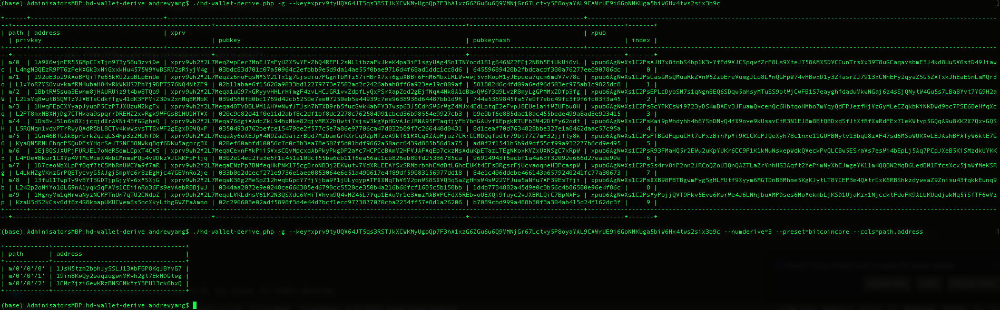

# Multi-Blockchain Wallet in Python

The multi-coin wallet allow us to use the same master key across multiple blockchains and integrate a universal key manager tool, Web3.py and Bit using python. The BIP44 standard allows us to use the same master seed for multiple coins. We will be able to generate many addresses from a single seed without having to create new wallets constantly and having to track their private keys. For every transaction, a new address will be generated, making accounting very easy while preserving privacy. This is the standard that exchanges use to generate crypto addresses and keep track of customer balances and transactions.
We used the hd-wallet-derive tool.

## Deriving Wallet Keys
Object called `coins` that derives `ETH` and `BTCTEST` wallets with this function.



### Bitcoin Testnet transaction

- Fund a `BTCTEST` address using [this testnet faucet](https://testnet-faucet.mempool.co/).

- Use a [block explorer](https://tbtc.bitaps.com/) to watch transactions on the address.

- Send a transaction to another testnet address (either one of your own, or the faucet's).

- Screenshot the confirmation of the transaction like so:



### Ethereum Testnet transaction

I sent a transaction from the pre-funded address within the wallet to another, then copied the `txid` into
  MyCrypto's TX Status, and screenshot the successful transaction here:




## Installing hd-wallet-derive tool using Mac OS X

The `hd-wallet-derive` library is written in the PHP language. PHP should be set up before installing and then run the `hd-wallet-derive` library.
While I was using a Mac OS X, I updated the pre-build PHP version to `v/7.3.24`.

#### Installing PHP by Updating the Pre-Built PHP in Mac OS X

To update the pre-built version of PHP in OS X, execute the following steps:

* Mac OS X already comes pre-built with PHP and the Apache Web Server; however, we will need to upgrade the PHP version to 7.3.

* Open the terminal and execute the following command to download and install PHP version 7.3.

 ```shell
 curl -s https://php-osx.liip.ch/install.sh | bash -s 7.3
 ```

* You will be asked to type your password to install the software package.



* **Important:** If you are on macOS Catalina and up (10.15+), your default shell is now `zsh`, instead of `bash` as in previous versions. No worries, however, since `zsh` can handle the same tasks. If you have yet to upgrade to Catalina, you will be using `bash` as your default shell, which will affect the commands you need to run below. Make sure you are running the commands appropriate for your system!

* Once the installation finishes, execute the command appropriate for your system:

  * macOS Catalina and above (`zsh` shell):

    ```shell
    nano ~/.zshrc
    ```

  * Versions prior to macOS Catalina (`bash` shell):

    ```shell
    nano ~/.bash_profile
    ```

* The `nano` text editor will be opened, scroll down to the end of the file and add the following commands to point to the newest version of PHP globally in your system.

 ```shell
 # PHP Path Config
 export PATH=/usr/local/php5/bin:$PATH
 export PATH
 ```


* Save the changes by pressing the `CONTROL + O` keys combination. Next, exit `nano` by pressing the `CONTROL + X` keys combination.

* **Close and reopen the terminal**. Next, verify that PHP version 7.3 is the current version in your system by executing the following command:

 ```shell
 php -version
 ```
* If you see the following output, then congratulations! Your machine is now updated to the newest version of PHP!



## hd-wallet-derive Installation

Now that the latest version of PHP is installed, we can now proceed to the installation of the `hd-wallet-derive` library.

Execute the following steps:

* Navigate to the [Github website](https://github.com/dan-da/hd-wallet-derive) for the `hd-wallet-derive` library and scroll down to the installation instructions.

 

* Next, open a terminal and execute the following commands.

> **Warning**: When cloning the project be conscious of what folder you are cloning the files into. It would probably be best to clone it into a previoulsy downloaded Go Ethereum Tools `geth & tools 1.9.7`  folder.

 ```shell
 git clone https://github.com/dan-da/hd-wallet-derive
 cd hd-wallet-derive
 php -r "readfile('https://getcomposer.org/installer');" | php
 php -d pcre.jit=0 composer.phar install
 ```

* You should now have a folder called `hd-wallet-derive` containing the PHP library.

## hd-wallet-derive Execution

Last step! Execute the `hd-wallet-derive` library to derive `BIP32` addresses and private keys for Bitcoin and other alternative coins.

* Navigate to your `hd-wallet-derive` folder.

 

* Then execute the following commands (these are examples from the GitHub website).

 ```shell
 ./hd-wallet-derive.php -g --key=xprv9tyUQV64JT5qs3RSTJkXCWKMyUgoQp7F3hA1xzG6ZGu6u6Q9VMNjGr67Lctvy5P8oyaYAL9CAWrUE9i6GoNMKUga5biW6Hx4tws2six3b9c
 ```

 ```shell
 ./hd-wallet-derive.php -g --key=xprv9tyUQV64JT5qs3RSTJkXCWKMyUgoQp7F3hA1xzG6ZGu6u6Q9VMNjGr67Lctvy5P8oyaYAL9CAWrUE9i6GoNMKUga5biW6Hx4tws2six3b9c --numderive=3 --preset=bitcoincore --cols=path,address --path-change
 ```

 

* Congratulations! The `hd-wallet-derive` library should now be working and good to go!


